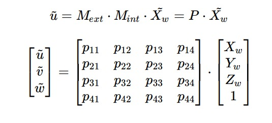

# Camera Calibration in Mocap Arena    
Check the results of camera calibration project in Mocap Arena.

- This project came from the need to improve the camera calibration results of Mocap Arena, once our system works with an error in focal distance calibration, which impacts the accuracy of the results when switching between pairs of cameras. 
- This folder contains the code you need to calibrate your camera with differents camera models and patterns availables.

## What is Camera calibration? 
Camera calibration is the process to discover the camera configuration! The cameras that we are used to seeing are mades with some importants parameters, which describes the image formation. 
- The external parameters of the camera describe the position and orientation of the camera in the world system.
- The internal parameters shows how the camera maps the perspective projetion points in the world onto its image.

The image correlation with world coordinates is described the perspective projection matrix. With some linear algebra, are possible to, given a point in the scene, convert him to the image coordinate system. The perspective projection matrix is show below: 

So, to calibrate our camera, all it's needed is to discover the camera projection matrix!
- To check more of the camera calibration foudantions check [How reconstruc 3D space from images](https://github.com/MateusPincho/Calibration-Mocap/blob/main/Bibliography/How%20reconstruct%20a%20three%20dimensional%20space%20from%20images.pdf) .

## Why I need calibrate my camera? 
For applications dealing with measurements, the camera calibration step is necessary. To proceed, know how the camera reconstruct the scene it's required.

## How procede with camera calibration
First, choose a know geometry object. For example, use a flat calibration target which the features are know. 
- In other words, the points of the target are know in the world coordinate system.
- The commun is choose a chessboard or a circle grids, but ArUco Markers works as well.

Second, take pictures of it in differents poses. 
- The pictures must have the calibration target in different positions and orientations
- 20 pictures is more than necessary. 

Third, correlate the image points with the world points of the calibration target. After this, the projection matrix is discovered and the camera calibration is finished! 

## How I know my calibration was corrected? 

### How I can improve my results? 

## Bibliography
This are some articles I used in my research:
